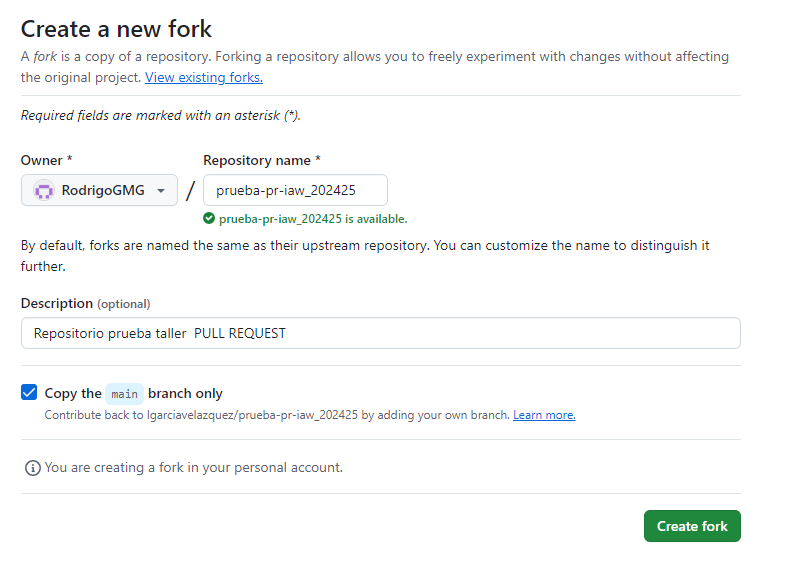
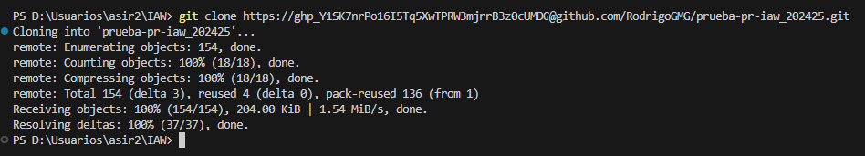
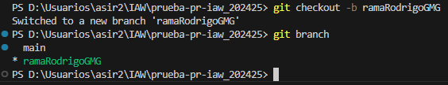
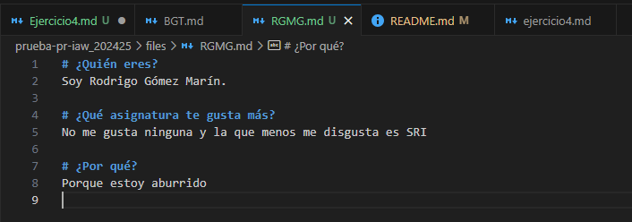
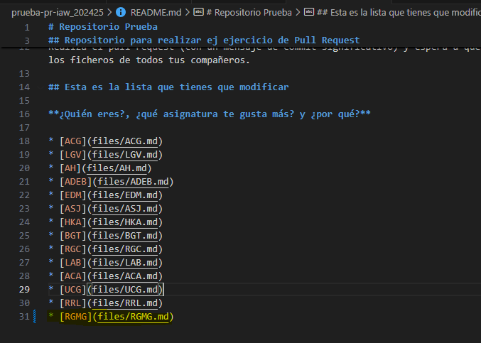
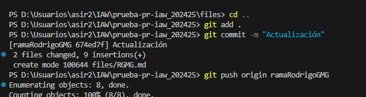
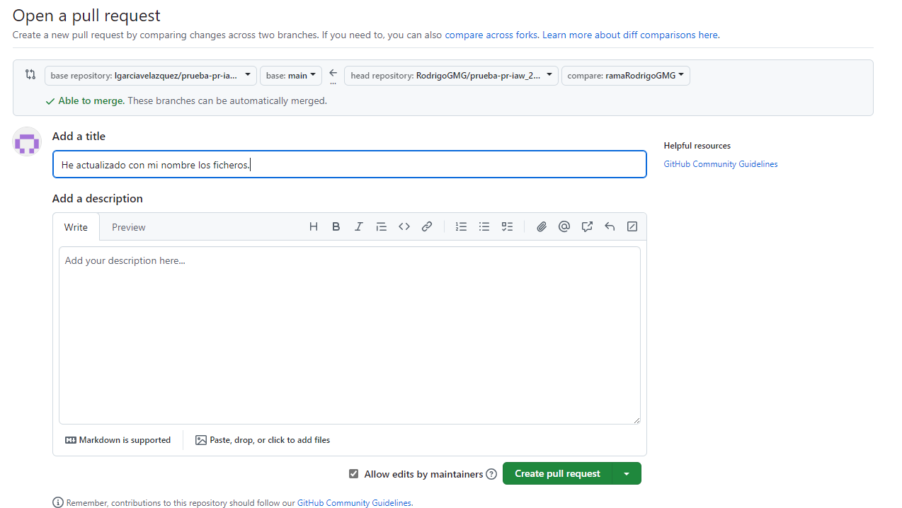
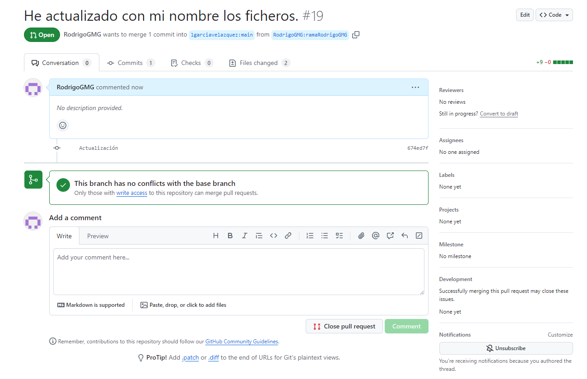

# Ejercicio 4

## Crear el fork

## Clonar repositorio

## Crear la rama

## Crear ocumento con nuestras iniciales

## Lo añado al fichero README

## Hacemos Pull-Request

## Luis ha recibido el request
